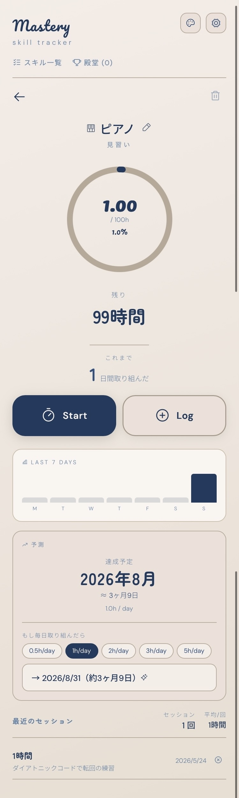
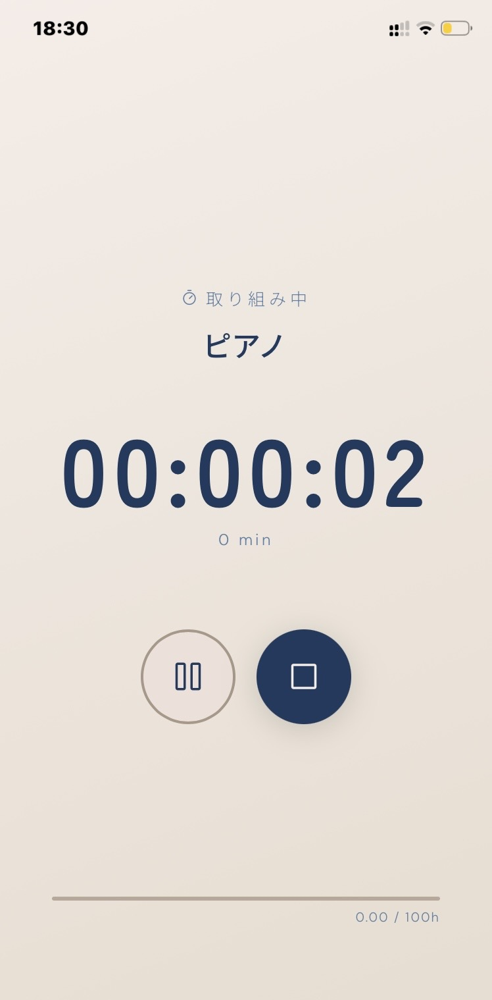
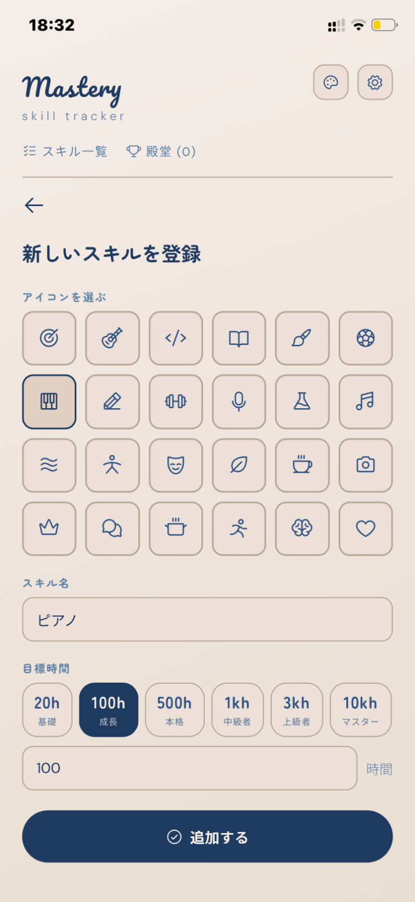

# Mastery - Skill Tracker

ピアノの練習を100時間したくて作った、スキルの習熟時間を記録できる習熟トラッカーアプリです。

個人用に作ったものなので、今後も使いやすいように勝手に更新していきます。
fork free / 改造自由です。MITライセンスに準拠して自由に使ってください。

A tiny tracker I made for practicing piano for 100 hours.

This was built as a personal tool, so I’ll probably keep updating it casually in whatever ways make it more usable for myself.
Feel free to modify it however you like.  
Released under the MIT License.

## Screens

  

## 特徴

- **タイマー** — 一時停止・再開対応のフルスクリーンタイマー
- **手動記録** — 分単位でセッションを記録、メモも残せる
- **達成予測** — 最近のペースから目標達成日を自動計算
- **週間グラフ** — 過去7日の取り組みを可視化
- **5言語対応** — 日本語 / English / Português / 繁體中文 / 한국어
- **14テーマ** — 時間帯で自動切り替えも可能
- **PWA対応** — ホーム画面に追加してアプリとして使える
- **データ管理** — IndexedDBで安全に保存、JSON形式でエクスポート/インポート可能

## 使い方

👉 **[アプリを開く](https://kumanonii.github.io/mastery-tracker/)**

### ホーム画面に追加（iPhone）

1. Safariでアプリを開く
1. 共有ボタン →「ホーム画面に追加」

### スキルを追加

1. 「＋ 新しいスキルを追加」をタップ
1. アイコン・スキル名・目標時間を設定

### 記録する

- **タイマー** — `Start` ボタンで計測開始、停止後にメモを記録
- **手動記録** — `Log` ボタンで分数を入力して記録
- **スワイプ** — スキル一覧を右スワイプでタイマーをすぐ起動

## 技術スタック

- Vanilla HTML / CSS / JavaScript（フレームワークなし）
- [Phosphor Icons](https://phosphoricons.com/)
- [Google Fonts](https://fonts.google.com/)（Pacifico / Zen Maru Gothic / Jua / DM Sans / Noto Sans）
- IndexedDB（データ保存）
- PWA（Service Worker）

## ライセンス

MIT License © 2026 kumanonii
